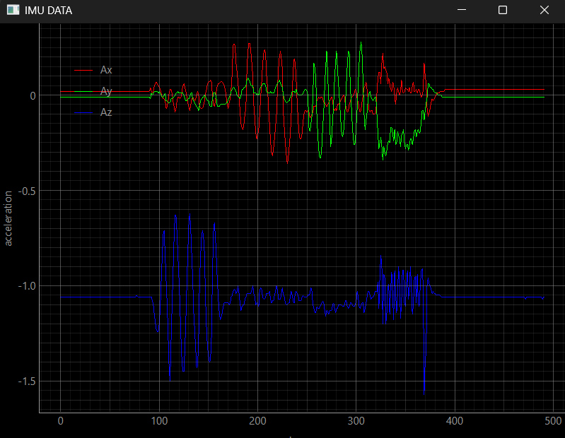

# ESP32 IMU Flight Computer

An ESP32-based IMU data acquisition and telemetry system designed to explore embedded flight-computer concepts.

The system acquires 3-axis acceleration measurements from an MPU-9250, records timestamped raw and filtered sensor data to a microSD card, applies real-time EWMA filtering and outlier rejection, and transmits filtered telemetry over Bluetooth to a Python ground station for live visualization.

## Hardware Prototype

The prototype integrates an ESP32, MPU-9250 IMU, and microSD module on a breadboard. The ESP32 handles sensor acquisition, filtering, data logging, and Bluetooth telemetry.


## Features

- MPU-9250 3-axis acceleration acquisition over I2C
- Timestamped microSD data logging over SPI
- Raw and filtered acceleration recording
- Exponentially Weighted Moving Average (EWMA) filtering
- Outlier rejection for abnormal measurements
- Bluetooth Classic serial telemetry
- Telemetry packet framing and validation
- Python ground station
- Real-time PyQtGraph visualization
- Ground-station CSV logging

## System Architecture

```text
                    MPU-9250
                        |
                       I2C
                        |
                        v
                      ESP32
                        |
              +---------+---------+
              |                   |
              v                   v
          Raw Data        Outlier Rejection
              |                   |
              |                   v
              |              EWMA Filter
              |                   |
              v                   v
          microSD  <------- Filtered Data
                                  |
                                  v
                         Bluetooth Telemetry
                                  |
                                  v
                         Python Ground Station
                           |             |
                           v             v
                       CSV Log      Live PyQtGraph
```

## Signal Filtering

The system uses an Exponentially Weighted Moving Average:

`y[k] = (1 - alpha)y[k-1] + alpha*x[k]`

where:

- `x[k]` = newest accelerometer measurement
- `y[k-1]` = previous filtered measurement
- `y[k]` = updated filtered measurement
- `alpha = 0.2`

Before the EWMA stage, each measurement is checked against a maximum allowed change. Measurements exceeding this threshold are rejected. This is the outlier check.

## Data Logging

The ESP32 stores both raw and filtered acceleration measurements on a microSD card.

Each sample is timestamped using the ESP32 system timer.

CSV format:

```text
time_ms,raw_ax,raw_ay,raw_az,filt_ax,filt_ay,filt_az
```

Recording both raw and filtered data allows the filter performance to be evaluated after each test.

## Bluetooth Telemetry

Filtered acceleration is transmitted using Bluetooth Classic serial communication.

Packet format:

```text
IMU:,Ax,Ay,Az
```

The Python ground station validates the packet header and number of fields before accepting each measurement.

This prevents malformed or incomplete packets from being interpreted as valid sensor data.

## Ground Station

The Python ground station:

- receives Bluetooth serial telemetry
- validates incoming packets
- extracts X, Y, and Z acceleration
- records received telemetry to CSV
- plots acceleration live using PyQtGraph

## Ground Station Visualization

Filtered X, Y, and Z acceleration data is transmitted over Bluetooth and plotted in real time using the Python ground station.



## Hardware

- ESP32 development board
- MPU-9250 IMU
- MicroSD card module
- MicroSD card

## Software

### Embedded

- C++
- Arduino framework
- PlatformIO
- I2C
- SPI
- Bluetooth Classic

### Ground Station

- Python
- PySerial
- PyQt6
- PyQtGraph

## Repository Structure

```text
include/          Firmware header files
src/              ESP32 firmware
groundstation/    Python ground-station software
platformio.ini    PlatformIO configuration
```

## Results

The completed system successfully:

- Acquired 3-axis accelerometer data from the MPU-9250
- Logged timestamped raw and filtered measurements to microSD
- Applied EWMA filtering and outlier rejection in real time
- Transmitted filtered telemetry over Bluetooth
- Validated incoming telemetry packets on the ground station
- Visualized all three acceleration axes in real time
- Recorded received telemetry to a separate CSV file

A representative test dataset is available in [`docs/imudata.csv`](docs/imudata.csv).

## Future Improvements

- Gyroscope and magnetometer integration
- Attitude estimation
- Complementary or Kalman sensor fusion
- Barometric altitude sensing
- Additional fault detection
- Custom PCB integration